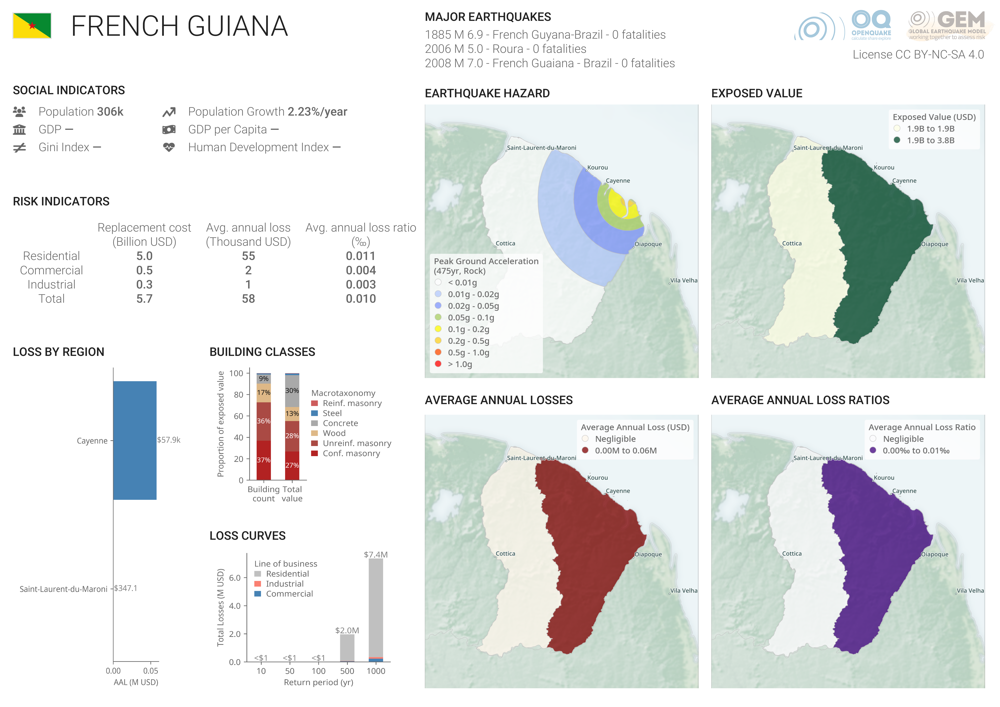

# French_Guiana

## Profile

## Overview

### Major earthquakes

In general, the major earthquakes shown in each profile are those that incurred the most fatalities according to databases such as the NOAA Significant Earthquake Database[^1] and EM-DAT[^2]. For countries with numerous earthquakes, more recent deadly or damaging events were prioritized over older, deadlier events.

### Social indicators

In general, the World Bank's World Development Indicators (WDI)[^3] were used as the source of the social indicators presented. For some countries and territories, data was not available. In these cases, available national statistics were investigated. Where national statistics were unavailable, alternate sources may be used.

- **Population:** The estimated population for the entire country/territory. The values shown are for year 2021.
- **Population growth:** The estimated annual population growth. The values shown are for year 2021.
- **Gross domestic product (GDP):** The gross domestic product is a measure of the health of a country/territory's economy, based on the market value of finished goods and services produced within its boundaries. 
- **GDP per capita:** The estimated gross domestic product for the entire country/territory normalized by the total population (i.e., breaking down the value per person). The values shown are for year 2021.
- **Gini index:** The Gini index measures income/wealth inequality, with values ranging from 0% (perfect equality) to 100% (perfect inequality). 
- **Human Development Index:**  The Human Development Index aims to quantify key dimensions of human development: a long and healthy life, knowledge, and a decent standard of living. Values range from 0 (low human development) to 1 (high humand development). The values shown are for year 2021.

### Risk indicators

The risk results are the results of an event-based risk analysis, where 100,000 years of earthquakes are simulated.

Three lines of business are considered: residential, commercial, and industrial. Therefore, value or earthquake losses to other building occupancies (e.g., schools, healthcare) and infrastructure are not included.

- **Replacement cost:** This represents the aggregate cost to replace all residential, commercial, and industrial buildings in the country/territory. This includes the value of the building (structural+nonstructural) and contents. In many cases, it is assumed that non-code conforming buildings will be replaced with code-conforming buildings, thereby increasing their unit cost. Costs are representative of 2021 US Dollars (USD).
- **Average annual loss:** This represents the absolute loss due to damaged residential, commercial, and industrial buildings that occurs every year, on average, due to earthquake ground shaking.
- **Average annual loss ratio:** This represents the relative loss due to damaged residential, commercial, and industrial buildings that occurs every year, on average, due to earthquake ground shaking. In this case, the loss is normalized by the replacement value.

### Maps

The boundaries and names shown and the designations used in this publication do not imply official endorsement or acceptance by the GEM Foundation.

The following maps are included: 

- **Earthquake hazard:** The earthquake hazard represents the peak ground acceleration for an average return period of 475 years on rock.
- **Exposed value:** The exposure is represented by the subnational distribution of the replacement value of residential, commercial, and industrial buildings. Costs are representative of 2021 US Dollars (USD).
- **Average annual losses:** The risk is represented by the subnational distribution of average annual losses (AAL) due to residential, commercial, and industrial building damage from earthquakes. The darkest colors signify those areas expected to have the greatest absolute value of loss.
- **Average annual loss ratios:** The risk is represented by the subnational distribution of average annual loss ratios (AALR) due to residential, commercial, and industrial building damage from earthquakes. In this case, the values are normalized by the exposed value to signify those areas that are expected to experience disproportionate damage.

### Charts

The risk results are the results of an event-based risk analysis, where 100,000 years of earthquakes are simulated.

- **Loss by region:** The average annual loss (AAL) by subnational boundary. Note that the boundary names presented may not exactly match current convention.
- **Building classes:** The proportion of the  building stock in terms of count and replacement value distributed to different macrotaxonomy classes: adobe/earth, unreinforced masonry, reinforced masonry, confined masonry, wood, concrete, steel, light metal, mixed, and other.
- **Loss curves:** The mean return period losses for average return periods of 10, 50, 100, 500, and 1,000 years.

## License
[![CC BY-NC-SA 4.0][cc-by-nc-sa-shield]][cc-by-nc-sa]

This work is licensed under a
[Creative Commons Attribution-NonCommercial-ShareAlike 4.0 International License][cc-by-nc-sa], which requires:

* Attribution (you must give appropriate credit, provide a link to the license, and indicate if changes were made)
* Non-commercial (you may not use the material for commercial purposes)
* ShareAlike (derivatives created must be made available under the same license as the original)

[![CC BY-NC-SA 4.0][cc-by-nc-sa-image]][cc-by-nc-sa]

[cc-by-nc-sa]: http://creativecommons.org/licenses/by-nc-sa/4.0/
[cc-by-nc-sa-image]: https://licensebuttons.net/l/by-nc-sa/4.0/88x31.png
[cc-by-nc-sa-shield]: https://img.shields.io/badge/License-CC%20BY--NC--SA%204.0-lightgrey.svg

Any deviation from these terms incur in license infringement. For commercial use of the data contained within this work, a specific license agreement must be made tailored to your use case, in such instance please contact GEM at product@globalquakemodel.org

## References

[^1]: National Geophysical Data Center / World Data Service (NGDC/WDS): NCEI/WDS Global Significant Earthquake Database. NOAA National Centers for Environmental Information. doi:[10.7289/V5TD9V7K](https://doi.org/10.7289/V5TD9V7K)

[^2]: EM-DAT: The International Disaster Database EM-DAT. (2008) Available at: [https://www.emdat.be/](https://www.emdat.be/)

[^3]: World Development Indicators. Washington, D.C.:The World Bank. Available at: [https://databank.worldbank.org/source/world-development-indicators](https://databank.worldbank.org/source/world-development-indicators)
